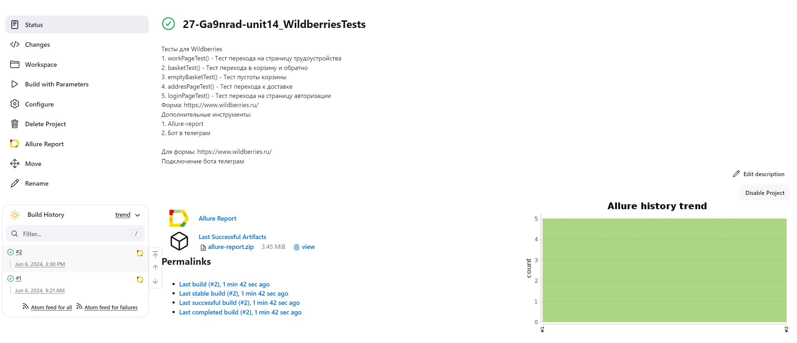
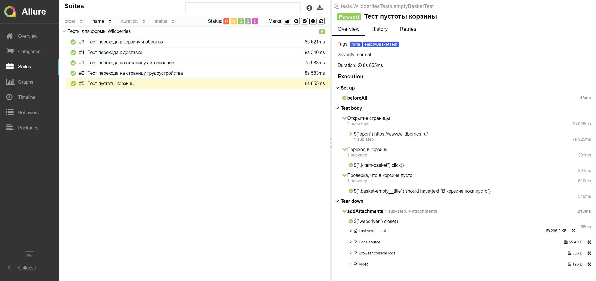
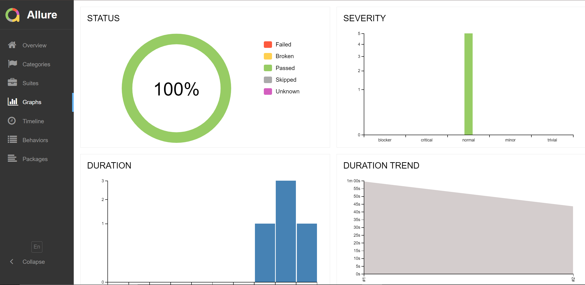
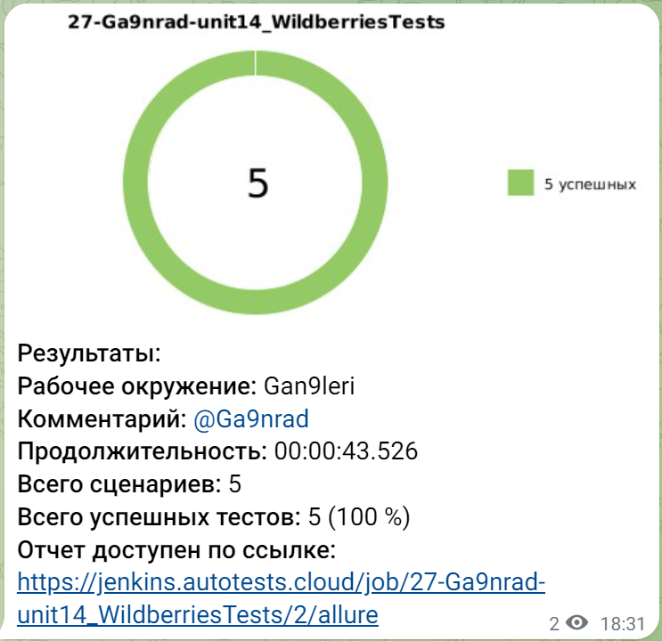

# Домашнее задание к уроку 14 - автоматические тесты для [Wildberries](https://www.wildberries.ru/)
## :scroll: Содержание:

- [Используемый стек](#computer-используемый-стек)
- [Описание автотестов](#pushpin-описание-тестов)
- [Запуск автотестов](#arrow_forward-запуск-автотестов)
- [Сборка в Jenkins](#-сборка-в-jenkins)
- [Пример Allure-отчета](#-пример-allure-отчета)
- [Графики и диаграммы](#-графики-и-диаграммы)
- [Уведомления в Telegram](#-уведомления-в-telegram)
- [Видео примера запуска тестов в Selenoid](#-видео-примера-запуска-теста-в-selenoid)

##  :computer: Используемый стек

<p align="center">


</p>

Тесты в данном проекте написаны на языке <code>Java</code> с использованием фреймворка для тестирования [Selenide](https://selenide.org/), сборщик - <code>Gradle</code>. <code>JUnit 5</code> задействован в качестве фреймворка модульного тестирования.
При прогоне тестов для запуска браузеров используется [Selenoid](https://aerokube.com/selenoid/).
Для удаленного запуска реализована джоба в <code>Jenkins</code> с формированием Allure-отчета и отправкой результатов в <code>Telegram</code> при помощи бота.

## :pushpin: Описание тестов:
- ✓ *workPageTest() - Тест перехода на страницу трудоустройства*
- ✓ *basketTest() - Тест перехода в корзину и обратно* 
- ✓ *emptyBasketTest() - Тест пустоты корзины*
- ✓ *addresPageTest() - Тест перехода к доставке*
- ✓ *loginPageTest() - Тест перехода на страницу авторизации*
 
Содержание Allure-отчета:
* Шаги теста;
* Скриншот страницы на последнем шаге;
* Page Source;
* Логи браузерной консоли;
* Видео выполнения автотеста.

## :arrow_forward: Запуск автотестов

### Запуск тестов из терминала
```
gradle clean test WildberriesTests -Dselenoid_url="selenoid.autotests.cloud/wd/hub" -Dbrowser_size="1920х1080" -Dbrowser="chrome" -Dbrowser_version="100.0"
```
При выполнении данной команды в терминале IDE тесты запустятся удаленно в <code>Selenoid</code>. 


##  Сборка в Jenkins

Для запуска сборки необходимо перейти в раздел <code>Build with parameters</code> и нажать кнопку <code>Build</code>.

После выполнения сборки, в блоке <code>Build history</code> напротив номера сборки появятся значки <code>Allure Report</code> и <code>Allure TestOps</code>, при клике на которые откроется страница с сформированным html-отчетом и тестовой документацией соответственно.

<p align="center">

</p>

##  Пример Allure-отчета

<p align="center">

</p>

##  Графики и диаграммы

<p align="center">

</p>

###  Уведомления в Telegram

После завершения сборки специальный бот, созданный в <code>Telegram</code>, автоматически обрабатывает и отправляет сообщение с отчетом о прогоне тестов.

<p align="center">

</p>

###  Видео примера запуска тестов в Selenoid

В отчетах Allure для каждого теста прикреплен не только скриншот, но и видео прохождения теста
<p align="center">
  
</p>
